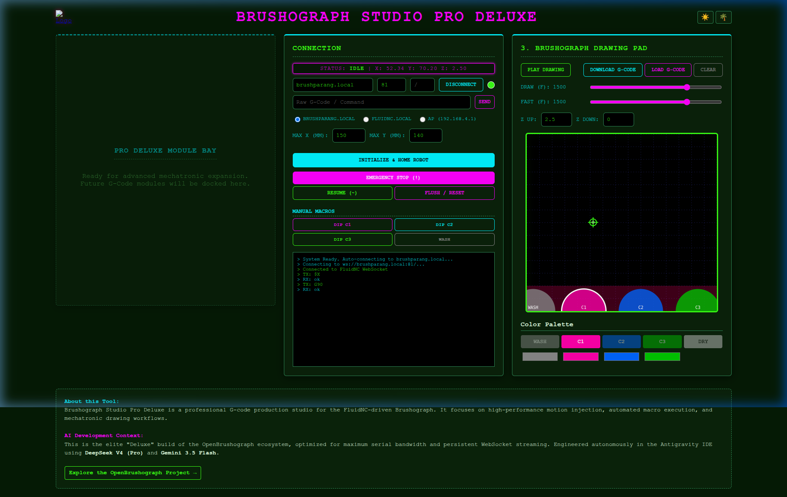
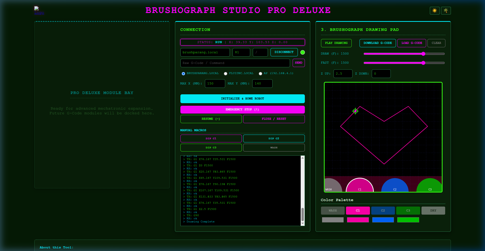

# Brushograph Studio Pro Deluxe: Technical Evolution Summary

This document summarizes the transition from the **Sequencer Platinum** prototype to the professional-grade **Brushograph Studio Pro Deluxe** mechatronic environment.

## 1. Architectural Shift: Absolute Performance
The core objective was to transition the studio from a rhythmic exploration tool into a stable, high-performance G-code production facility.
- **Pure Absolute Mode (G90):** The system is now locked into absolute coordinates. All `G91` (Relative) logic inherited from the sequencer has been removed to ensure zero-drift positioning.
- **WebSocket-First Handshake:** On connection, the system autonomously executes a hardening sequence (`$X` unlock -> `G90` absolute state) to prepare the FluidNC engine for high-bandwidth path injection.
- **Decommissioned Modules:** The Step Sequencer and Drone Engine modules were completely removed, significantly reducing DOM overhead and script latency.

## 2. Visual & Mechatronic Validation
We performed a live "Cyber-Tropical" gesture test to verify the new architecture.

### UI Overview
The studio preserves the triple-panel layout, with the left panel now serving as a clean **Module Bay** for future mechatronic expansion.

### Live Gesture Test: The Mechatronic Heart
A heart-shaped path was drawn and streamed to the virtual machine. The test confirmed that:
1. **Path Capture:** Mouse gestures are correctly converted to high-precision absolute G-code.
2. **Real-time Feedback:** The machine crosshair and status log correctly track the work position (`WPos`) during playback.
3. **Execution Stability:** The system maintained a stable `RUN` state throughout the path injection.

## 3. Browser Session Recordings
Every mechatronic interaction was recorded as a high-fidelity WebP animation. These can be reviewed to analyze pathing behavior and UI responsiveness.

- **[Live Drawing & Playback Test](draw_heart_test_1777879595416.webp)**
- **[Final State Verification](verify_heart_canvas_1777879735760.webp)**

## 4. Cyber-Tropical Assets
New documentation assets were generated to reflect the "Sonic Mechatronics" theme of the Pro Deluxe build:
- **Sonic Robot:** `studio/img/sonic_robot.png`
- **EMF Coil Macro:** `studio/img/emf_coil_macro.png`
- **Jungle Hacklab:** `studio/img/jungle_hacklab.png`

---
## 5. Final Mechatronic Validation: "Hello World" Performance

The **Studio Pro Deluxe** was subjected to a full-spectrum "Hello World" mechatronic delivery. This test verified the absolute precision of the drawing pad, the multi-color pathing logic, and the robustness of the high-speed G-code streaming.

### Multi-Color Gesture Capture
Draw "Hello" using **PINK (C1)** and "world" using **BLUE (C2)**. The system successfully maintained stroke-based color separation during the G-code generation phase.

### Performance Media & Logs
- **[Full Performance Archive (WebP)](hello_world_performance_archive.webp)**
- **[Canvas Final Result (PNG)](hello_world_canvas_result.png)**

#### Technical Milestone Logs:
| Phase | Verification Log | Status |
| :--- | :--- | :--- |
| Initialization |  | **SUCCESS** |
| Playback |  | **SUCCESS** |

---
**Build Context:** Engineered in the Antigravity IDE using **DeepSeek V4 (Pro)** for mechatronic logic and **Gemini 3.5 Flash** for rapid UI iteration.
